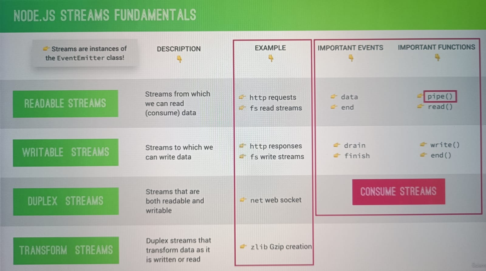

# How Backend works

The backend (or “server-side”) is the portion of the website you don't see. It's responsible for storing and organizing data, and ensuring everything on the client-side actually works. The backend communicates with the frontend, sending and receiving information to be displayed as a web page.

Generally user sends request to server, and server sends back response.
Response header has response code, if 200, response is ok and successfull.

## Node JS:

1. Node JS is powered by Google V8 engine.
2. Libuv (created in c++) is used in building node.
3. Node JS is single threaded architecture.
4. On its single thread event loop runs.

## Streams:

1. Used to process(read and write) data piece by piece(chunks), without completing the whole read or write operation.
2. Therefore we don't have keep all the the data in memory to perform these operationss
3. e.g Video streaming sites like youtube and netflix. They don't wait to load all video, instead they read video stream by stream
4. Streams are perfect candidate for handling large volumes of data

### Types of streams:

1. Readable Streams
2. Writable Streams
3. Duplex Streams
4. Transform Streams

### Back pressure

1. Readable stream is much faster than actually sending the result with response writable stream in network.
2. This will overwhelm the response stream, which cannot handle all this coming data superfast.
3. This problem is called as Back Pressure.
