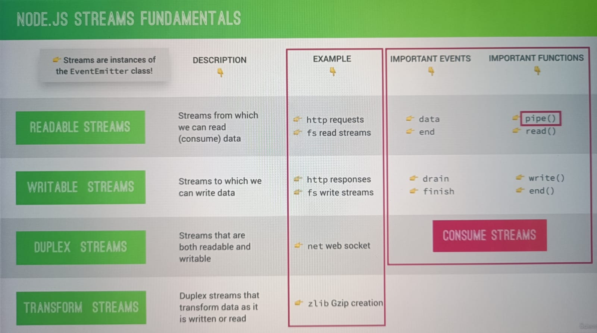

## Node JS:

1. Node JS is powered by Google V8 engine.
2. Libuv (created in c++) is used in building node.
3. Node JS is single threaded architecture.
4. On its single thread event loop runs.

## Streams:

1. Used to process(read and write) data piece by piece(chunks), without completing the whole read or write operation.
2. Therefore we don't have keep all the the data in memory to perform these operationss
3. e.g Video streaming sites like youtube and netflix. They don't wait to load all video, instead they read video stream by stream
4. Streams are perfect candidate for handling large volumes of data

### Types of streams:

1. Readable Streams
2. Writable Streams
3. Duplex Streams
4. Transform Streams

### Back pressure

1. Readable stream is much faster than actually sending the result with response writable stream in network.
2. This will overwhelm the response stream, which cannot handle all this coming data superfast.
3. This problem is called as Back Pressure.

## A common module system

Each js file is considered as a separate module.

### What happens when we require() a module

Resolving and Loading => Wrapping => Execution => Returning Export => Caching

1. Loading: Involves path to module.
2. Wraping: Global node function (main) has argument require. So we can use require in node.
   (exports, require, module, \_filename, \_dirname) => These are globle scope variables
3. Execution: After module file import is resolved it is executed.
4. Returning Export: require() function returns exported content in require(<module>)
5. Caching: Modules are actually cached after they are loaded. Importing module happens only once.It is tored in cache and then used everytime required.
