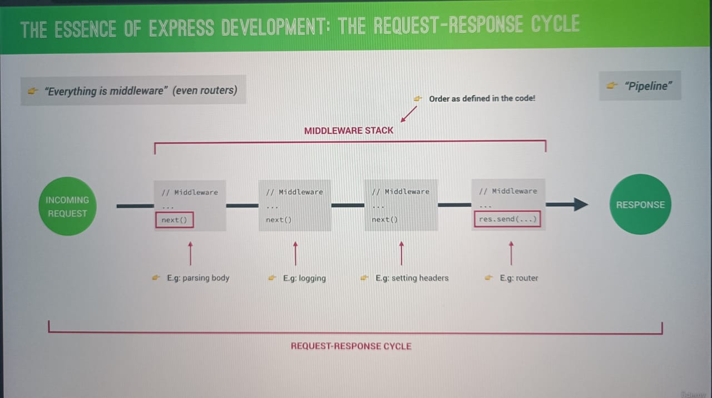

# Express

1. Express is a minimal node.js framework, a higher level of abstraction.
2. It is build on top of node js.
3. Express have a very robust set of features: complex routing, easier handling requests and response, middleware and serverside rendering, etc.
4. Express allows rapid development of node.js, in MVC architecture.

## Rest api architecture

1. API : Application Programming Interface. A piece of software that can be used by another piece of software.

### REST:

1. Separate api into logical resources
2. Expose structured, resource based url's
3. Use HTTP methods (verbs)
4. Send data as JSON
5. Be stateless

## Middleware

1. To access req and res object we use middleware.
2. We use **'app.use()'** method yo use middleware

